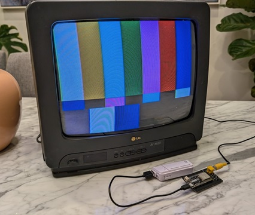
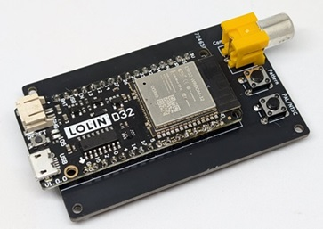

# ESP32-TestPatternGenerator

    

This is a simple test pattern generator that runs on the ESP32 microcontroller and utilises the [ESP32CompositeColorVideo](https://github.com/marciot/ESP32CompositeColorVideo) library to output composite video using either the PAL and NTSC video formats. 

This tool is aimed to be used as a quick and portable was of performing tests of basic functionality for CRT TVs.

Its main features are:
- **Cheap**: Approximately <$10 USD in parts
- **Accessible**: Open source. Only a few components so soldering is easy for a first timer.
- **Small**: Roughly 2x3"/45x80mm in size.
- **Fast**: Boots and changes patterns instantly.
- **Portable**: Very low power draw, works with a powerbank or rechargeable LiPo battery.
- **Versatile**: Supports NTSC and PAL, and provides multiple test patterns.

For a similar tool aimed at 15kHz RGB video, see the [RP2040-TestPatternGenerator](https://github.com/nmur/RP2040-TestPatternGenerator).
## BOM

1. LOLIN D32 board ([Official LOLIN AliExpress store](https://www.aliexpress.us/item/2251832622236364.html), [cheaper listings](https://www.aliexpress.us/item/3256806060247101.html) may be available)
	1. 2x 16 pin headers are usually included
2. 2x 6mm push buttons ([AliExpress](https://www.aliexpress.us/item/2261799870049698.html))
3. Female composite jack ([AliExpress](https://www.aliexpress.us/item/2255800475452071.html))
4. Composite video cable if you don't already have one ([AliExpress](https://www.aliexpress.us/item/3256806419160332.html))
## Building a Board

1. Download the latest [Gerber zip file](https://github.com/nmur/ESP32-TestPatternGenerator/blob/main/plots/ESP32-TestPatternGenerator.zip).
2. Upload and print the Gerber file to a PCB manufacturing website (such as JLCPCB or PCBWay).
3. Solder the components into their marked positions. 

The circuit is simple enough that a PCB isn't necessary, especially if you would just like to try the tool out first with a breadboard or protoboard. You can even splice a composite video cable and wire the ends directly to the ESP32 board pins, and you can omit the buttons if you don't need every pattern (the tool remembers the last video format).

The schematic is available [here](https://raw.githubusercontent.com/nmur/ESP32-TestPatternGenerator/refs/heads/main/img/schematic.png).
## Uploading the Firmware

Navigate to the [Installation page](https://nmur.github.io/ESP32-TestPatternGenerator-WebInstaller/) to connect to your device and flash the firmware from your browser directly. You'll need to install [CH340 drivers](https://www.wch-ic.com/downloads/CH341SER_ZIP.html) in order

## How to Use

Power the device using USB or and LiPo battery, and connect the composite cable to you CRT TV. Cycle through test patterns with the `Pattern` button, and toggle between video formats with the `PAL/NTSC` button. 

The device will remember the last video format so you don't need to toggle it to your region every time it boots.
## Limitations

Currently the available colours are limited to a palette of 256 colours. As such, noticeable colour banding will be present.

## Compiling

1. Clone the repository
2. Open the `ESP32-TestPatternGenerator.ino` file with the Arduino IDE
3. Install version 1.0.6 of the ESP32 board manager
4. Connect your device via USB
5. Build and upload the program

## Acknowledgements

- [bitluni](https://www.youtube.com/@bitluni) for his original [ESP32CompositeVideo](https://github.com/bitluni/ESP32CompositeVideo) project
- [marciot](https://github.com/marciot) for his [ESP32CompositeColorVideo](https://github.com/marciot/ESP32CompositeColorVideo) library forked from the original project above
- [rossumur](https://github.com/rossumur) for his work on the [ESP_8_BIT](https://github.com/rossumur/esp_8_bit) project
- [Artemio Urbina](https://github.com/ArtemioUrbina) for his test patterns 
